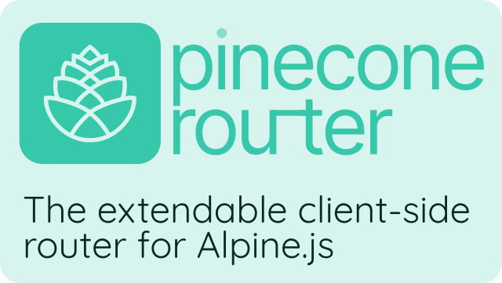

<p align="center">
  
</p>

[](https://github.com/pinecone-router/router/tree/0.1.0)
[](https://bundlephobia.com/result?p=pinecone-router@0.1.0)
[](https://www.jsdelivr.com/package/gh/pinecone-router/router)
[](https://www.jsdelivr.com/package/npm/pinecone-router)
[](https://npmjs.com/package/pinecone-router)

[](/CHANGELOG.md)

# Pinecone Router

The extendable client-side router for Alpine.js.

## About

An easy to use but feature-packed client-side router for use with Alpine.js.

It can be used to:

-   Handle routes, process route variables.
-   Use magic helper `$router` helper to display elements dynamically etc. inside Alpine.js Components.
-   Render specific views, or automatically display server-rendered pages with preloading.
-   many more using [middlewares](#middlewares).

## Features:

-   :smile: Easy and familiar syntax well integrated with Alpine.js.
-   :link: Automatically dispatch relative links and handle them ([optional](#settings)).
-   :hash: [Hash routing](#hash-routing).
-   :heavy_plus_sign: Extendable using tiny [Middlewares! 🪜](#middlewares)
-   :sparkles: [Magic **$router** helper](#magic-helper) to access current route, props, redirect, ect. from _all_ alpine components!

## Installation

Not ready for production yet, **[needs reviewing and more testing, help welcome!](/CONTRIBUTING.md)**

> **Watch releases for version 1.0!**

### CDN

Include the following `<script>` tag in the `<head>` of your document, before Alpine.js:

```html
<script src="https://cdn.jsdelivr.net/npm/pinecone-router@0.1.0/dist/index.umd.js"></script>
```

**ES6 Module:**

```javascript
import 'https://cdn.jsdelivr.net/npm/pinecone-router@0.1.0/dist/index.umd.js';
```

### NPM

```
npm install pinecone-router
```

```javascript
// load pinecone router
import 'pinecone-router';
// then load alpine.js
import 'alpinejs';
```

> **Important**: This must be added **before** loading Alpine.js.

> **Note**: [Smaller, feature-specific builds](/CONTRIBUTING.md) will be available soon, help welcome.

## Usage

### Handle routes

1.  Create an Alpine component with the `x-router` attribute.
2.  Declare routes by creating a template tag with `x-route` and `x-handler` attributes.
3.  The `x-handler` must be a name of one method or comma-separated list of methods within the component.

```html
<div x-data="router()" x-router>
	<template x-route="/" x-handler="main"></template>
	<template x-route="/hello/:name" x-handler="hello"></template>
	<template x-route="notfound" x-handler="notfound"></template>
</div>
```

> **Important**: There can only be one router in the page!

The javascript:

```js
function router() {
	return {
		main(context) {
			console.log('main');
		},
		hello(context) {
			console.log('hello,', context.props.name);
		},
		notfound(context) {
			console.error(context.path + ' is not found');
		},
	};
}
```

#### Context Object

The handler takes `context` which consist of:

-   context.route (/path/:var)
-   context.path (/path/something)
-   context.props ({var: something})
-   context.hash (hash fragment without the #)
-   context.query (search query without the ?)
-   **context.redirect(path: string)** function that allow you to redirect to another page.
-   -   **Important** usage within x-handler: `return context.redirect('/path');`

#### Multiple Handlers

**Tip**: You can use multiple comma-separated handler names:

```html
<template x-route="/hello/:name" x-handler="chackname, hello"></template>
```

### Hash routing

You may use hash routing by simply adding `x-hash` attribute to the router component:

```html
<div x-data="router()" x-router x-hash>...</div>
```

### Middlewares

Pinecone Router is extendable through middlewares!

#### Official Middlewares

-   [Render views](https://github.com/pinecone-router/middleware-views): manually set the view for each route and have it rendered!

-   [Display server rendered pages](https://github.com/pinecone-router/middleware-render): automatically load server-rendered pages with preloading (like Turbolinks)

Create your own middlewares [using this template](https://github.com/pinecone-router/middleware-template)!

### Redirecting

It can be done many ways! here's how:

**From an Alpine component**:

-   use [`$router` magic helper](#magic-helper): `$router.redirect(path)`.
-   -   example: `@click="$router.redirect(path)"`

**Redirecting from the handler**:

To redirect from inside a handler function use the context's `redirect` method:

```js
handler(context) {
	...
	return context.redirect(path)
}
```

> **important** inside the handler you _must_ return the `context.redirect()` function.

**Navigating from Javascript**:

To navigate to another page from javascript you can:

```js
window.PineconeRouter.navigate(path);
```

### Settings:

There are a few settings you may tweak for your liking.

**Base path:** is set with the `x-base` attribute.
**Trailing slash:** `x-slash="add"` or empty to force adding trailing slash or `x-slash="remove"` to force removing them.

More to come!

### Events:

Pinecone Router dispatch these events:

| name               | recipient | when is it dispatched                      |
| ------------------ | --------- | ------------------------------------------ |
| **pinecone-init**  | window    | when the router and routes are initialized |
| **pinecone-start** | window    | when the page start loading                |
| **pinecone-end**   | window    | when the page loading ends                 |

### Global Context

You can access current path's [context](#context-object) from alpine components use [$router magic helper](#magic-helper) or from anywhere in your javascript by accessing `window.PineconeRouter.currentContext`.

### Magic Helper

To make it easier to access the [current context](#context-object) from anywhere, you can use the `$router` magic helper:

**Usage**:
Refer to [global context](#global-context).
`$router.props.name`, `$router.redirect(path)`, `$router.hash`, [etc](#context-object).

<details>
	<summary>
		<strong>Advanced</strong>
	</summary>

### Javascript configuration

> Javascript configuration option in the making.

### Adding & Removing routes with Javascript

you can add routes & remove them anytime using Javascript.

**Adding a route**: `window.PineconeRouter.addRoute(path, handlers)`

-   path: string, the route's path.
-   handlers: array of functions, the handlers of the route.

**Removing a route**: `window.PineconeRouter.removeRoute(path)`

-   path: string, the path of the route you want to remove.

</details>

## Contributing:

Please refer to [CONTRIBUTING.md](/CONTRIBUTING.md)

## Credits

This library uses modified chunks of code from [this tutorial](https://medium.com/swlh/lets-code-a-client-side-router-for-your-no-framework-spa-19da93105e10) & from [page.js](https://github.com/visionmedia/page.js). The parts used are speficied in [source comments](src/).

## Acknowledgment

[@KevinBatdorf](https://twitter.com/KevinBatdorf) for ideas and early feedback!

> **Disclaimer**: not affiliated with the Alpine.js team, developed independently.

## Versioning

This projects follow the [Semantic Versioning](https://semver.org/) guidelines.

## License

Copyright (c) 2021 Rafik El Hadi Houari and contributors

Licensed under the MIT license, see [LICENSE.md](LICENSE.md) for details.

<a rel="license" href="http://creativecommons.org/licenses/by-sa/4.0/"></a><br /><span xmlns:dct="http://purl.org/dc/terms/" href="http://purl.org/dc/dcmitype/StillImage" property="dct:title" rel="dct:type">Pinecone Router <a href="https://github.com/pinecone-router/logo">Logo</a></span> by <a xmlns:cc="http://creativecommons.org/ns#" href="https://rehhouari.eu.org" property="cc:attributionName" rel="cc:attributionURL">Rafik El Hadi Houari</a> is licensed under a <a rel="license" href="http://creativecommons.org/licenses/by-sa/4.0/">Creative Commons Attribution-ShareAlike 4.0 International License</a>.

> Code from [Page.js](https://github.com/visionmedia/page.js#license) is licenced under the MIT License.
> Copyright (c) 2012 TJ Holowaychuk <tj@vision-media.ca>

> Code from [Simple-javascript-router tutorial](https://github.com/vijitail/simple-javascript-router/) is licenced under the MIT License.
> Copyright (c) 2021 Vijit Ail (https://github.com/vijitail).
