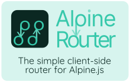

# Alpine Router
The simple client-side router for Alpine.js. (WIP)


[](https://www.jsdelivr.com/package/gh/rehhouari/alpine-router)

## About

A simple router for use with Alpine.js.

## Features:
- Easy and familiar syntax well integrated with Alpine.js. 
- Automatically dispatch relative links and handle them (optional).
- Can have multiple routers in the same page that can share routes.

## Installation
WIP! documentation coming soon, not ready for production yet.

### CDN
Include the following `<script>` tag in the `<head>` of your document:

```html
<script src="https://cdn.jsdelivr.net/gh/rehhouari/alpine-router@master/dist/alpine-router.umd.js"></script>
```
##### or
 If you use ES6 Modules:
```javascript
import 'https://cdn.jsdelivr.net/gh/rehhouari/alpine-router@master/dist/alpine-router.module.js'
```

## Usage

Create an Alpine component with the `x-router` attribute specifying the name of the router, leave empty for "default" (names must be unique).

Declare routes by creating a template tag with `x-route` and `x-handler` attributes.

The `x-handler` must be a method of the router component.

```html
<div x-data="handle()" x-router>
	<template x-route="/hello/:name" x-handler="hello"></template>
	<template x-route="/" x-handler="main"></template>
	<template x-route="notfound" x-handler="notfound"></template>
</div>
```

The handler takes `props` as an argument which will have path variales.

```js
function handle() {
	return {
		main(props) {
			console.log('main');
		},
		hello(props) {
			console.log('hello,', props.name);
		},
		notfound(props) {
			console.log('not found');
		},
	};
}
```

> **Important**: This must be added **before** loading Alpine.js.

## Credits!
Currenly this library uses chunks of code from [this tutorial](https://medium.com/swlh/lets-code-a-client-side-router-for-your-no-framework-spa-19da93105e10) & from [page.js](https://github.com/visionmedia/page.js). The parts used are speficied in [source comments](src/).

## Versioning

This projects follow the [Semantic Versioning](https://semver.org/) guidelines.

## License

Copyright (c) 2021 Rafik El Hadi Houari and contributors

Licensed under the MIT license, see [LICENSE.md](LICENSE.md) for details.

>Code from [Page.js](https://github.com/visionmedia/page.js#license) is licenced under the MIT License.
>Copyright (c) 2012 TJ Holowaychuk <tj@vision-media.ca>

>Code from [Simple-javascript-router tutorial](https://github.com/vijitail/simple-javascript-router/) is written by [Vijit Ail](https://github.com/vijitail).
